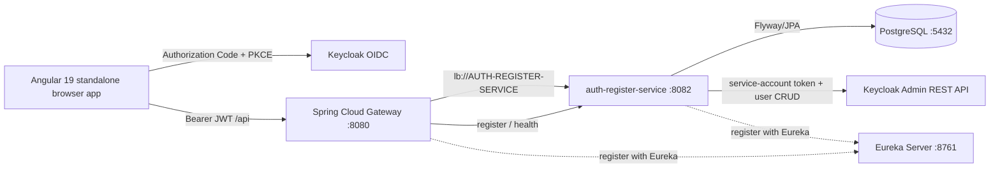

# DevFlow AI architecture

## Context

The source product description defines four human roles and one external monitoring actor:

- Support agents create and follow incidents.
- Developers investigate, comment, resolve, and document root causes.
- Managers assign incidents, monitor workload, and validate closure.
- Administrators manage users, roles, projects, services, and knowledge.
- Monitoring systems submit alerts and trigger automatic incident creation.

The initial implementation establishes the identity and edge foundation before adding the incident domain and AI services.

## Request topology



## Authentication flow

1. The Angular `AuthService` initializes Keycloak with the standard flow and S256 PKCE.
2. Keycloak authenticates the user and returns to the Angular application with an authorization code.
3. The browser obtains an access token containing `realm_access.roles`.
4. The Angular interceptor adds the bearer token only to `/api` requests.
5. The gateway validates the issuer/signature and maps `realm_access.roles` to `ROLE_*` authorities.
6. The auth service repeats validation for direct service access and resolves the local profile by Keycloak subject or preferred username. Pre-provisioned Keycloak identities can receive a read-only token-backed profile; users created through registration are persisted in PostgreSQL.

The application never accepts or stores a user password during login. Registration sends the password once to the auth service, which uses it only for the Keycloak credential and never writes it to PostgreSQL.

## Registration consistency model

The registration operation is intentionally compensating rather than pretending PostgreSQL and Keycloak share a transaction:

1. Validate the request and check local uniqueness.
2. Create a temporary Keycloak user.
3. Assign the default `ROLE_SUPPORT` realm role.
4. Persist the sanitized profile in PostgreSQL.
5. If a later step fails, attempt to delete the Keycloak identity and preserve the original error.

A production deployment should add an outbox/reconciliation job for compensation failures and an audit event for every identity mutation.

## Module boundaries

### `discovery-server`

Eureka is intentionally infrastructure-only and does not contain product APIs. It runs on port `8761` and is configured not to register with itself.

### `api-gateway`

The gateway is the only browser-facing backend entry point. It:

- registers with Eureka;
- resolves `lb://AUTH-REGISTER-SERVICE` routes;
- validates Keycloak JWTs;
- maps Keycloak realm roles to Spring Security authorities;
- applies CORS and health-path rules;
- keeps service credentials and database concerns out of the browser.

### `auth-register-service`

The service owns the first bounded context:

- registration DTO validation and RFC 9457 error responses;
- Keycloak Admin REST user lifecycle;
- PostgreSQL profile projection and Flyway schema;
- current-user lookup for a validated principal;
- health/actuator endpoints.

## Security boundaries

- Public: Angular routes, Keycloak endpoints, registration, health checks.
- Authenticated: `/api/auth/me` and all future application APIs.
- Role-aware: future incident endpoints should use `ROLE_ADMIN`, `ROLE_MANAGER`, `ROLE_DEVELOPER`, and `ROLE_SUPPORT` in method security.
- Secrets: the service-account secret is an environment variable; the checked-in realm secret is a local-development fixture only.

## Planned service boundaries

The next services should remain independently deployable:

```text
incident-service       lifecycle, comments, audit, assignments
ai-analysis-service    advisory classification and investigation suggestions
knowledge-service     document upload, chunking, and RAG search
notification-adapter   Kafka/n8n delivery boundary
monitoring-adapter     Prometheus/Alertmanager ingestion
```

The frontend should consume stable gateway contracts rather than coupling directly to these services.

## Availability and audit decisions from the requirements

- AI failures must not block incident creation; the incident API should publish work asynchronously.
- Human authorization remains required for severity changes, resolution, and closure.
- State transitions should be recorded as audit events.
- Critical incidents should emit a notification event, but notification delivery should be retried independently.
